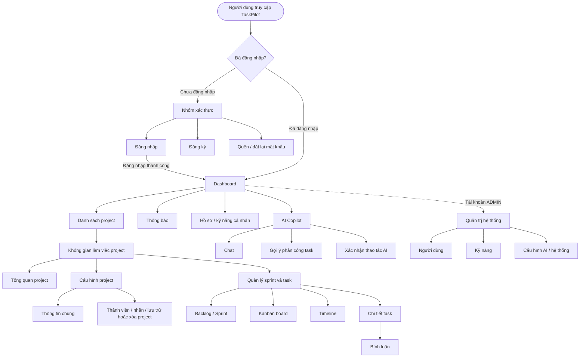

# CHƯƠNG 4. XÂY DỰNG ỨNG DỤNG

## 4.1. Tổng quan giao diện và luồng điều hướng

TaskPilot được xây dựng như một ứng dụng web phục vụ quản lý project, sprint, task và hỗ trợ phân công công việc bằng AI Agent. Luồng giao diện được chia thành ba nhóm chính: nhóm xác thực cho người dùng chưa đăng nhập, nhóm màn hình làm việc chính sau khi đăng nhập và nhóm màn hình quản trị dành cho tài khoản có quyền Admin.

Hình 4.1 mô tả luồng điều hướng tổng quan của giao diện TaskPilot. Sau khi đăng nhập, người dùng đi từ Dashboard đến danh sách project và mở không gian làm việc của từng project. Trong workspace, người dùng có thể xem tổng quan, cấu hình project, quản lý backlog, sprint, Kanban board, timeline, chi tiết task và bình luận. AI Copilot được đặt như một khu vực hỗ trợ riêng, bao gồm chat, gợi ý phân công task và xác nhận thao tác trước khi ghi dữ liệu.

Hình 4.1: Sơ đồ tổng quan luồng điều hướng giao diện TaskPilot

## 4.2. Màn hình xác thực người dùng

### 4.2.1. Màn hình đăng nhập

Màn hình đăng nhập là điểm vào chính cho người dùng đã có tài khoản. Giao diện kết hợp phần giới thiệu TaskPilot ở bên trái và form đăng nhập ở bên phải, giúp người dùng nhập email, mật khẩu, chuyển sang khôi phục mật khẩu hoặc đăng ký tài khoản mới.

[Hình 4.2: Màn hình đăng nhập người dùng - file: ch4_02_login.png]

Bảng 4.1: Bảng mô tả thành phần màn hình đăng nhập

| STT | Thành phần | Loại | Mô tả |
| --- | ---------- | ---- | ----- |
| 1 | Khối giới thiệu TaskPilot Workspace | Card | Hiển thị thông điệp giới thiệu mục tiêu của hệ thống: theo dõi deadline, cộng tác và giám sát tiến độ project. |
| 2 | Logo và tên TaskPilot | Card | Tạo nhận diện thương hiệu cho màn hình đăng nhập. |
| 3 | Khung đăng nhập | Form | Chứa toàn bộ trường nhập và thao tác xác thực người dùng. |
| 4 | Trường Email | Input | Cho phép nhập địa chỉ email, có placeholder gợi ý định dạng email. |
| 5 | Trường Password | Input | Cho phép nhập mật khẩu và che nội dung nhập. |
| 6 | Nút xem/ẩn mật khẩu | Button | Cho phép người dùng kiểm tra hoặc ẩn mật khẩu trước khi đăng nhập. |
| 7 | Liên kết Forgot password | Button | Điều hướng người dùng đến chức năng khôi phục mật khẩu. |
| 8 | Nút Login | Button | Gửi thông tin đăng nhập để truy cập hệ thống. |
| 9 | Liên kết Sign up now | Button | Điều hướng sang màn hình đăng ký tài khoản mới. |
| 10 | Nút chuyển ngôn ngữ | Button | Cho phép thay đổi ngôn ngữ hiển thị của giao diện. |

## 4.3. Màn hình dashboard và quản lý dự án

### 4.3.1. Dashboard người dùng

Dashboard cung cấp thông tin tổng quan sau khi đăng nhập, gồm thông tin người dùng hiện tại, trạng thái tài khoản, khối lượng công việc và danh sách kỹ năng. Đây là màn hình giúp người dùng kiểm tra nhanh hồ sơ làm việc trước khi chuyển sang quản lý project.

[Hình 4.3: Dashboard người dùng - file: ch4_05_dashboard.png]

Bảng 4.2: Bảng mô tả thành phần màn hình dashboard người dùng

| STT | Thành phần | Loại | Mô tả |
| --- | ---------- | ---- | ----- |
| 1 | Thanh điều hướng bên | Sidebar | Cung cấp lối truy cập đến Dashboard, Projects, Notifications, Comments, Copilot và các mục cá nhân. |
| 2 | Nút thu gọn sidebar | Button | Cho phép mở hoặc thu gọn vùng điều hướng bên trái. |
| 3 | Nút chuyển ngôn ngữ | Button | Cho phép thay đổi ngôn ngữ giao diện. |
| 4 | Nhóm chọn chế độ hiển thị | Button | Cho phép chọn Light, Dark, Glass hoặc System. |
| 5 | Bảng chọn màu chính | Button | Cho phép người dùng đổi màu nhấn chính của giao diện. |
| 6 | Nút Check Connection | Button | Kiểm tra trạng thái kết nối của hệ thống từ giao diện người dùng. |
| 7 | Thẻ Current User | Card | Hiển thị email và họ tên của người dùng hiện tại. |
| 8 | Thẻ Account Status | Card | Hiển thị trạng thái tài khoản và vai trò bằng các nhãn trạng thái. |
| 9 | Nhãn trạng thái tài khoản | Badge | Thể hiện trạng thái như AVAILABLE và vai trò USER. |
| 10 | Thẻ Workload | Card | Hiển thị khối lượng công việc hiện tại nếu có dữ liệu. |
| 11 | Thẻ My Skills | Card | Trình bày danh sách kỹ năng cá nhân của người dùng. |
| 12 | Nhãn kỹ năng | Badge | Hiển thị tên kỹ năng và cấp độ tương ứng, ví dụ React - level 3. |

### 4.3.2. Danh sách project và tạo project

Màn hình quản lý project cho phép người dùng xem các project đã tham gia, tìm kiếm project, rời project và tạo project mới. Form tạo project được đặt cạnh danh sách để người dùng có thể nhập thông tin cơ bản, chọn chế độ phân bổ và khai báo thời gian thực hiện.

[Hình 4.4: Danh sách project và tạo project - file: ch4_06_create_project.png]

Bảng 4.3: Bảng mô tả thành phần màn hình danh sách project và tạo project

| STT | Thành phần | Loại | Mô tả |
| --- | ---------- | ---- | ----- |
| 1 | Thanh điều hướng bên | Sidebar | Giữ nguyên ngữ cảnh điều hướng chính của ứng dụng khi người dùng làm việc với project. |
| 2 | Tiêu đề My Projects | Card | Xác định khu vực quản lý project của người dùng. |
| 3 | Ô tìm kiếm project | Search box | Cho phép lọc danh sách project theo từ khóa. |
| 4 | Nút Search | Button | Thực hiện tìm kiếm theo nội dung đã nhập. |
| 5 | Bảng danh sách project | Table | Hiển thị project, vai trò, trạng thái, ngày tham gia và thao tác tương ứng. |
| 6 | Nhãn vai trò | Badge | Thể hiện vai trò của người dùng trong project như Manager hoặc Member. |
| 7 | Nhãn trạng thái project | Badge | Cho biết project đang ở trạng thái Active. |
| 8 | Nút Rời project | Button | Cho phép người dùng rời khỏi project đang tham gia. |
| 9 | Bộ chọn số dòng | Dropdown | Cho phép chọn số lượng project hiển thị trên mỗi trang. |
| 10 | Điều hướng phân trang | Button | Cho phép chuyển sang trang trước hoặc trang sau của danh sách. |
| 11 | Nút Reload Data | Button | Tải lại dữ liệu project từ hệ thống. |
| 12 | Form Create Project | Form | Cho phép tạo project mới bằng các thông tin cần thiết. |
| 13 | Trường Project Name | Input | Nhập tên project mới. |
| 14 | Trường Description | Text area | Nhập mô tả, mục tiêu hoặc ghi chú của project. |
| 15 | Bộ chọn Allocation Mode | Dropdown | Chọn chế độ phân bổ, ví dụ Balanced. |
| 16 | Trường Start Date và End Date | Date picker | Chọn ngày bắt đầu và ngày kết thúc của project. |
| 17 | Nút Create Project | Button | Gửi form để tạo project mới. |
| 18 | Khung Join Project | Form | Cung cấp khu vực tham gia project bằng thông tin mời nếu người dùng cần. |

## 4.4. Màn hình tổng quan project

### 4.4.1. Tổng quan project

Màn hình tổng quan project giúp người dùng nắm được tình trạng chung của project, bao gồm thông tin mô tả, timeline, tiến độ, số lượng task theo trạng thái, sprint hiện tại và thành viên trong nhóm. Từ màn hình này, người dùng có thể nhanh chóng chuyển sang các vùng Board, Backlog, Timeline hoặc mở cấu hình project.

[Hình 4.5: Tổng quan project - file: ch4_08_project_overview.png]

Bảng 4.4: Bảng mô tả thành phần màn hình tổng quan project

| STT | Thành phần | Loại | Mô tả |
| --- | ---------- | ---- | ----- |
| 1 | Tiêu đề project | Card | Hiển thị tên project và mô tả ngắn ở đầu màn hình. |
| 2 | Nút All Projects | Button | Cho phép quay lại danh sách project. |
| 3 | Nút Settings | Button | Mở màn hình cấu hình project. |
| 4 | Nút Create Task | Button | Cho phép tạo task mới trong project. |
| 5 | Nút Create Sprint | Button | Cho phép tạo sprint mới. |
| 6 | Nút tải lại | Button | Tải lại dữ liệu tổng quan project. |
| 7 | Thanh tab project | Tab navigation | Cho phép chuyển giữa Overview, Board, Backlog và Timeline. |
| 8 | Ô tìm kiếm task | Search box | Hỗ trợ tìm kiếm task trong project. |
| 9 | Thẻ thông tin project | Card | Hiển thị tên, trạng thái, mã project, số thành viên và khoảng thời gian thực hiện. |
| 10 | Nhãn trạng thái Active | Badge | Cho biết project đang hoạt động. |
| 11 | Khu vực mô tả | Card | Trình bày nội dung mô tả project. |
| 12 | Thẻ Progress Snapshot | Card | Hiển thị phần trăm hoàn thành và thanh tiến độ. |
| 13 | Thanh tiến độ | Progress bar | Minh họa trực quan mức độ hoàn thành của project. |
| 14 | Nhóm thống kê task | Card | Hiển thị tổng số task và số task theo trạng thái Done, In Progress, To Do. |
| 15 | Thẻ Current Sprint | Card | Hiển thị thông tin sprint hiện tại hoặc trạng thái chưa có dữ liệu. |
| 16 | Danh sách Team Members | List | Hiển thị thành viên trong project và số lượng thành viên. |

## 4.5. Màn hình cấu hình project

### 4.5.1. Cấu hình thông tin chung project

Màn hình cấu hình thông tin chung cho phép người dùng cập nhật tên, mô tả, trạng thái, chế độ heuristic, workflow và thời gian thực hiện của project. Đây là khu vực quản trị thông tin nền tảng của project trước khi quản lý sprint và task.

[Hình 4.6: Cấu hình thông tin chung project - file: ch4_23_project_setting_general.png]

Bảng 4.5: Bảng mô tả thành phần màn hình cấu hình thông tin chung project

| STT | Thành phần | Loại | Mô tả |
| --- | ---------- | ---- | ----- |
| 1 | Nút quay lại | Button | Cho phép trở về màn hình project trước đó. |
| 2 | Tiêu đề Settings | Card | Thể hiện ngữ cảnh cấu hình của project hiện tại. |
| 3 | Khung General | Form | Chứa các trường cập nhật thông tin chính và cấu hình workflow của project. |
| 4 | Trường Project Name | Input | Cho phép chỉnh sửa tên project. |
| 5 | Trường Description | Text area | Cho phép cập nhật mô tả project. |
| 6 | Bộ chọn Status | Dropdown | Cho phép chọn trạng thái hoạt động của project. |
| 7 | Bộ chọn Heuristic Mode | Dropdown | Cho phép chọn chế độ tính toán gợi ý phân công, ví dụ Balanced. |
| 8 | Bộ chọn Workflow Mode | Dropdown | Cho phép chọn cách tổ chức luồng công việc, ví dụ Kanban. |
| 9 | Trường Start Date | Date picker | Chọn ngày bắt đầu project. |
| 10 | Trường End Date | Date picker | Chọn ngày kết thúc project. |
| 11 | Nút Save Changes | Button | Lưu các thay đổi trong cấu hình thông tin chung. |
| 12 | Thanh điều hướng bên | Sidebar | Duy trì khả năng chuyển sang các khu vực khác của hệ thống. |

### 4.5.2. Thành viên, nhãn và thao tác lưu trữ/xóa project

Phần cấu hình thành viên, nhãn và thao tác lưu trữ/xóa project tập trung vào quản lý quyền truy cập project, mã mời tham gia, nhãn phân loại task và các thao tác có tác động lớn như lưu trữ hoặc xóa project.

[Hình 4.7: Thành viên, nhãn và thao tác lưu trữ/xóa project - file: ch4_24_project_settings_members.png]

Bảng 4.6: Bảng mô tả thành phần màn hình thành viên, nhãn và thao tác lưu trữ/xóa project

| STT | Thành phần | Loại | Mô tả |
| --- | ---------- | ---- | ----- |
| 1 | Khung Members | Card | Hiển thị danh sách thành viên và mô tả quyền truy cập project. |
| 2 | Mã Invite Code | Input | Hiển thị mã mời để người khác có thể tham gia project. |
| 3 | Nút Copy | Button | Sao chép mã mời project. |
| 4 | Danh sách thành viên | List | Hiển thị avatar, tên, email và ngày tham gia của từng thành viên. |
| 5 | Bộ chọn vai trò | Dropdown | Cho phép xem hoặc thay đổi vai trò thành viên như Manager. |
| 6 | Nút xóa thành viên | Button | Cho phép loại bỏ thành viên khỏi project khi có quyền phù hợp. |
| 7 | Khung Labels | Card | Quản lý nhãn dùng để phân loại task trong project. |
| 8 | Trường Label name | Input | Nhập tên nhãn mới. |
| 9 | Bộ chọn màu nhãn | Input | Chọn màu hoặc mã màu cho nhãn. |
| 10 | Nút Create Label | Button | Tạo nhãn mới cho project. |
| 11 | Danh sách nhãn | List | Hiển thị các nhãn đã tạo kèm màu đại diện. |
| 12 | Nút xóa nhãn | Button | Cho phép xóa nhãn khỏi project. |
| 13 | Khu vực lưu trữ/xóa project | Action section | Tập trung các thao tác có tác động lớn như lưu trữ hoặc xóa project. |
| 14 | Nút Archive Project | Button | Chuyển project sang trạng thái lưu trữ và có thể làm project chỉ đọc. |
| 15 | Nút Delete Project | Button | Xóa vĩnh viễn project và dữ liệu liên quan. |

## 4.6. Màn hình quản lý sprint và task

### 4.6.1. Backlog và sprint

Màn hình backlog giúp người dùng lập kế hoạch sprint và quản lý danh sách task theo nhóm chưa lên lịch hoặc theo từng sprint. Người dùng có thể tìm kiếm task, sắp xếp, bật hiển thị subtask và tạo task mới trong từng khu vực.

[Hình 4.8: Backlog và sprint - file: ch4_09_sprint_backlog.png]

Bảng 4.7: Bảng mô tả thành phần màn hình backlog và sprint

| STT | Thành phần | Loại | Mô tả |
| --- | ---------- | ---- | ----- |
| 1 | Tiêu đề project | Card | Hiển thị project hiện tại và mô tả ngắn. |
| 2 | Nhóm thao tác đầu trang | Button | Gồm All Projects, Settings, Create Task, Create Sprint và tải lại dữ liệu. |
| 3 | Thanh tab project | Tab navigation | Cho phép chuyển nhanh giữa Overview, Board, Backlog và Timeline. |
| 4 | Ô tìm kiếm task | Search box | Lọc task trong project theo nội dung nhập. |
| 5 | Khung Backlog | List | Hiển thị task chưa được lên lịch trong nhóm Backlog/Unscheduled. |
| 6 | Bộ chọn Custom Order | Dropdown | Cho phép thay đổi cách sắp xếp task. |
| 7 | Tùy chọn Show Subtasks | Button | Bật hoặc tắt việc hiển thị subtask trong danh sách. |
| 8 | Nhóm Backlog/Unscheduled | List | Hiển thị số lượng task chưa thuộc sprint và các task tương ứng. |
| 9 | Khung Sprint | Card | Hiển thị tên sprint, trạng thái, số task và thời gian của sprint. |
| 10 | Nhãn trạng thái sprint | Badge | Cho biết sprint đang Active hoặc trạng thái khác. |
| 11 | Thẻ task trong backlog | Card | Hiển thị mã task, tên task, người phụ trách, độ ưu tiên và trạng thái. |
| 12 | Thẻ subtask | Card | Hiển thị công việc con với nhãn Subtask và trạng thái riêng. |
| 13 | Nút Create Task trong nhóm | Button | Tạo task mới trong backlog hoặc sprint tương ứng. |
| 14 | Menu thao tác sprint | Dropdown | Cung cấp các thao tác bổ sung cho sprint. |

### 4.6.2. Kanban board

Kanban board thể hiện task theo trạng thái công việc, giúp người dùng theo dõi tiến độ trực quan qua các cột To Do, In Progress, Review và Done. Mỗi thẻ task hiển thị thông tin quan trọng như tên, mô tả, mã task, người phụ trách và mức ưu tiên.

[Hình 4.9: Kanban board - file: ch4_10_kanban_board.png]

Bảng 4.8: Bảng mô tả thành phần màn hình Kanban board

| STT | Thành phần | Loại | Mô tả |
| --- | ---------- | ---- | ----- |
| 1 | Thanh tab project | Tab navigation | Cho phép chuyển giữa các góc nhìn Overview, Board, Backlog và Timeline. |
| 2 | Ô tìm kiếm task | Search box | Tìm kiếm task trên board. |
| 3 | Cột To Do | Board column | Hiển thị các task chưa bắt đầu cùng số lượng task trong cột. |
| 4 | Cột In Progress | Board column | Hiển thị các task đang thực hiện và vùng thả task khi cột trống. |
| 5 | Cột Review | Board column | Hiển thị các task đang chờ kiểm tra. |
| 6 | Cột Done | Board column | Hiển thị các task đã hoàn thành. |
| 7 | Nút thêm task trong cột | Button | Cho phép tạo task mới trực tiếp theo trạng thái của cột. |
| 8 | Thẻ task | Card | Hiển thị tên task, mô tả ngắn và thông tin tóm tắt. |
| 9 | Mã task | Badge | Hiển thị định danh task như TP-5 hoặc TP-9. |
| 10 | Chỉ báo assignee | Badge | Hiển thị ký hiệu người phụ trách task. |
| 11 | Nhãn độ ưu tiên | Badge | Hiển thị mức ưu tiên như Low, Medium, High hoặc Urgent. |
| 12 | Vùng thả task | Board column | Hỗ trợ thao tác chuyển task vào cột trạng thái tương ứng. |
| 13 | Nút Create Task | Button | Tạo task mới từ đầu trang project. |
| 14 | Nút tải lại | Button | Làm mới dữ liệu board. |

### 4.6.3. Timeline

Timeline trình bày sprint và task theo trục thời gian, giúp người dùng đối chiếu ngày bắt đầu, ngày kết thúc và trạng thái thực hiện. Màn hình này hữu ích khi cần xem tiến độ theo lịch và nhận biết task đã hoàn thành, đang hoạt động hoặc quá hạn.

[Hình 4.10: Timeline task và sprint - file: ch4_17_timeline.png]

Bảng 4.9: Bảng mô tả thành phần màn hình timeline

| STT | Thành phần | Loại | Mô tả |
| --- | ---------- | ---- | ----- |
| 1 | Tiêu đề Timeline | Timeline view | Xác định góc nhìn sắp xếp task theo ngày bắt đầu và ngày đến hạn. |
| 2 | Khoảng thời gian tổng | Date picker | Hiển thị phạm vi ngày của timeline project. |
| 3 | Chú giải trạng thái | Badge | Giải thích màu sắc cho Active, Done và Overdue. |
| 4 | Khung sprint | Card | Nhóm các task thuộc cùng một sprint. |
| 5 | Tên và trạng thái sprint | Badge | Hiển thị Sprint 1, Sprint 2 và trạng thái Completed hoặc Active. |
| 6 | Khoảng thời gian sprint | Date picker | Cho biết ngày bắt đầu và ngày kết thúc của sprint. |
| 7 | Trục ngày | Timeline view | Hiển thị các mốc ngày để đối chiếu vị trí task. |
| 8 | Hàng Sprint dates | Timeline view | Minh họa khoảng thời gian diễn ra của sprint. |
| 9 | Hàng task | List | Hiển thị mã task, tên task, trạng thái và ngày thực hiện. |
| 10 | Thanh thời gian task | Progress bar | Biểu diễn khoảng thời gian task trên timeline bằng màu trạng thái. |
| 11 | Nhãn trạng thái task | Badge | Hiển thị trạng thái như Done hoặc Review cạnh từng task. |
| 12 | Thanh tab project | Tab navigation | Cho phép chuyển sang Overview, Board hoặc Backlog. |
| 13 | Ô tìm kiếm task | Search box | Hỗ trợ lọc task ngay trong ngữ cảnh timeline. |

## 4.7. Màn hình chi tiết task và bình luận

### 4.7.1. Chi tiết task

Màn hình chi tiết task mở trên nền workspace hiện tại, tập trung vào nội dung của một task cụ thể. Người dùng có thể xem mô tả, subtask, bình luận và cập nhật các thuộc tính như assignee, trạng thái, độ ưu tiên, ngày bắt đầu, ngày đến hạn, nhãn và kỹ năng yêu cầu.

[Hình 4.11: Chi tiết task - file: ch4_11_task_detail.png]

Bảng 4.10: Bảng mô tả thành phần màn hình chi tiết task

| STT | Thành phần | Loại | Mô tả |
| --- | ---------- | ---- | ----- |
| 1 | Khung chi tiết task | Modal/Dialog | Hiển thị chi tiết task trong một panel nổi trên workspace. |
| 2 | Nút đóng | Button | Đóng khung chi tiết task và quay về màn hình nền. |
| 3 | Mã task | Badge | Hiển thị định danh task như TP-3. |
| 4 | Nhãn trạng thái task | Badge | Cho biết trạng thái hiện tại, ví dụ Done. |
| 5 | Tiêu đề task | Card | Hiển thị tên task chính. |
| 6 | Khu vực Description | Card | Trình bày mô tả công việc. |
| 7 | Khu vực Subtasks | List | Hiển thị danh sách subtask hoặc trạng thái chưa có subtask. |
| 8 | Trường thêm subtask | Input | Cho phép nhập nhanh subtask mới. |
| 9 | Khu vực Comments | Card | Cho phép người dùng trao đổi về task. |
| 10 | Ô nhập bình luận | Text area | Nhập nội dung comment mới. |
| 11 | Nút Send | Button | Gửi bình luận vào task. |
| 12 | Bộ chọn Assignee | Dropdown | Cho phép chọn người phụ trách task. |
| 13 | Bộ chọn Status | Dropdown | Cho phép cập nhật trạng thái task. |
| 14 | Bộ chọn Priority | Dropdown | Cho phép cập nhật mức ưu tiên. |
| 15 | Trường Start Date và Due Date | Date picker | Cập nhật ngày bắt đầu và ngày đến hạn của task. |
| 16 | Nhãn Labels | Badge | Hiển thị nhãn phân loại task, ví dụ Urgent. |
| 17 | Nút Add Label | Button | Thêm nhãn cho task. |
| 18 | Nhãn Required Skills | Badge | Hiển thị kỹ năng yêu cầu như Java hoặc ElasticSearch. |
| 19 | Nút Add Skill | Button | Thêm kỹ năng yêu cầu cho task. |
| 20 | Nút mở task hoặc xóa task | Button | Cho phép mở task ở trang riêng hoặc xóa task nếu có quyền. |

### 4.7.2. Bình luận và mention trong task

Màn hình bình luận thể hiện luồng trao đổi giữa các thành viên trong task, bao gồm comment gốc, phản hồi lồng nhau, thời gian gửi, thao tác trả lời và hỗ trợ mention khi cần.

[Hình 4.12: Bình luận và mention trong task - file: ch4_15_comment_mention.png]

Bảng 4.11: Bảng mô tả thành phần màn hình bình luận và mention trong task

| STT | Thành phần | Loại | Mô tả |
| --- | ---------- | ---- | ----- |
| 1 | Thanh điều hướng bên | Sidebar | Cho phép chuyển giữa Dashboard, Projects, Notifications, Comments và Copilot. |
| 2 | Khu vực nhập bình luận | Text area | Cho phép nhập nội dung bình luận mới cho task. |
| 3 | Nút Send | Button | Gửi bình luận đã nhập. |
| 4 | Danh sách bình luận | List | Hiển thị các bình luận trong task theo thứ tự thời gian. |
| 5 | Avatar người bình luận | Badge | Nhận diện thành viên gửi bình luận. |
| 6 | Tên tác giả | Card | Hiển thị người tạo bình luận như Admin hoặc Bob Developer. |
| 7 | Thời gian bình luận | Card | Hiển thị thời điểm tạo bình luận. |
| 8 | Nội dung bình luận | Card | Trình bày nội dung trao đổi của người dùng. |
| 9 | Nút Reply | Button | Cho phép trả lời một bình luận cụ thể. |
| 10 | Nhóm phản hồi lồng nhau | List | Hiển thị các reply dưới comment gốc với mức thụt vào trực quan. |
| 11 | Menu thao tác bình luận | Dropdown | Cung cấp thao tác bổ sung cho từng bình luận. |
| 12 | Chỉ báo mention | Badge | Hiển thị thành viên được nhắc đến, ví dụ @Admin. |
| 13 | Thanh cuộn nội dung | Sidebar | Cho phép xem thêm các bình luận phía dưới. |

## 4.8. Màn hình thông báo

Màn hình thông báo giúp người dùng theo dõi các cập nhật liên quan đến task, project và trao đổi trong hệ thống. Người dùng có thể xem thông báo chưa đọc, phân biệt loại thông báo, xem thời gian phát sinh và đánh dấu đã đọc.

[Hình 4.13: Danh sách thông báo - file: ch4_13_notification.png]

Bảng 4.12: Bảng mô tả thành phần màn hình thông báo

| STT | Thành phần | Loại | Mô tả |
| --- | ---------- | ---- | ----- |
| 1 | Thanh điều hướng bên | Sidebar | Hiển thị mục Notifications đang được chọn và chỉ báo thông báo chưa đọc. |
| 2 | Tiêu đề Notifications | Card | Xác định màn hình theo dõi các cập nhật quan trọng. |
| 3 | Nút Mark all as read | Button | Đánh dấu toàn bộ thông báo là đã đọc. |
| 4 | Khung Notification Inbox | List | Hiển thị tổng quan số thông báo chưa đọc và danh sách thông báo. |
| 5 | Thẻ thông báo | Card | Mỗi thẻ gồm tiêu đề, nội dung, loại thông báo và thời gian. |
| 6 | Biểu tượng thông báo | Badge | Giúp nhận biết đây là một mục thông báo trong inbox. |
| 7 | Nhãn New | Badge | Đánh dấu thông báo chưa đọc. |
| 8 | Nội dung thông báo | Card | Mô tả sự kiện như được giao task, thành viên mới tham gia hoặc có phản hồi mới. |
| 9 | Loại thông báo | Badge | Hiển thị loại như SYSTEM, REPLY hoặc COMMENT. |
| 10 | Thời gian thông báo | Card | Hiển thị thời điểm phát sinh thông báo. |
| 11 | Nút Mark as read | Button | Đánh dấu một thông báo cụ thể là đã đọc. |
| 12 | Thanh cuộn danh sách | List | Cho phép xem thêm các thông báo khác. |

## 4.9. Màn hình AI Copilot

### 4.9.1. Chat AI Copilot

Chat AI Copilot là trạng thái trao đổi trực tiếp giữa người dùng và AI Agent. Người dùng có thể tạo hoặc chọn phiên hội thoại, gửi câu hỏi về quản lý project và nhận phản hồi từ TaskPilot AI trong cùng một giao diện.

[Hình 4.14: Chat AI Copilot - file: ch4_14_ai_chat.png]

Bảng 4.13: Bảng mô tả thành phần màn hình chat AI Copilot

| STT | Thành phần | Loại | Mô tả |
| --- | ---------- | ---- | ----- |
| 1 | Thanh điều hướng bên | Sidebar | Hiển thị mục Copilot đang được chọn trong điều hướng chính. |
| 2 | Sidebar phiên chat | Sidebar | Liệt kê các hội thoại Copilot trước đó. |
| 3 | Nút tạo phiên mới | Button | Tạo một phiên chat mới với AI Copilot. |
| 4 | Mục hội thoại | List | Hiển thị tiêu đề ngắn của từng phiên chat. |
| 5 | Khung hội thoại chính | Chat panel | Hiển thị tin nhắn người dùng và phản hồi của TaskPilot AI. |
| 6 | Tin nhắn người dùng | Chat panel | Hiển thị nội dung người dùng gửi, căn về phía người dùng. |
| 7 | Tin nhắn AI | Chat panel | Hiển thị phản hồi của TaskPilot AI. |
| 8 | Ô nhập yêu cầu | Text area | Cho phép nhập câu hỏi hoặc yêu cầu hỗ trợ quản lý project. |
| 9 | Nút Send | Button | Gửi nội dung trong ô nhập cho AI Copilot. |
| 10 | Bộ đếm ký tự | Badge | Hiển thị số ký tự đã nhập so với giới hạn. |
| 11 | Cảnh báo kiểm chứng thông tin | Card | Nhắc người dùng kiểm tra lại thông tin quan trọng do AI có thể sai. |
| 12 | Nút tài khoản người dùng | Button | Hiển thị truy cập thông tin người dùng ở góc giao diện. |

### 4.9.2. Gợi ý phân công task

Trạng thái gợi ý phân công task trình bày kết quả phân tích ứng viên cho một task cụ thể. AI Copilot hiển thị bảng xếp hạng ứng viên, các thành phần điểm, lý do phân tích và đề xuất assignee phù hợp nhất.

[Hình 4.15: Gợi ý phân công task - file: ch4_16_assignment_recommendation.png]

Bảng 4.14: Bảng mô tả thành phần màn hình gợi ý phân công task

| STT | Thành phần | Loại | Mô tả |
| --- | ---------- | ---- | ----- |
| 1 | Trạng thái xử lý | Result card | Hiển thị trạng thái AI đang phân tích và cho phép xem tiến trình xử lý. |
| 2 | Nút xem tiến trình xử lý | Button | Mở phần tiến trình xử lý của AI nếu người dùng cần xem. |
| 3 | Đoạn ngữ cảnh task | Card | Cho biết AI đang phân tích ứng viên cho task cụ thể. |
| 4 | Bảng xếp hạng ứng viên | Table | So sánh các thành viên có thể nhận task. |
| 5 | Cột Ứng viên | Table | Hiển thị tên thành viên được đánh giá. |
| 6 | Cột Fit Score | Table | Thể hiện mức độ phù hợp tổng quát với task. |
| 7 | Cột Load Score | Table | Thể hiện thành phần điểm liên quan đến tải công việc theo cách hiển thị của giao diện. |
| 8 | Cột Performance Score | Table | Thể hiện điểm hiệu suất làm việc. |
| 9 | Cột Confidence Score | Table | Thể hiện độ tin cậy của đánh giá. |
| 10 | Cột Skill Score | Table | Thể hiện mức độ phù hợp kỹ năng. |
| 11 | Cột Workload Score | Table | Thể hiện mức cân bằng khối lượng công việc. |
| 12 | Cột Total Score | Table | Tổng hợp điểm cuối cùng để xếp hạng ứng viên. |
| 13 | Cột Workload và Trạng thái | Table | Hiển thị khối lượng công việc hiện tại và trạng thái như Busy hoặc Available. |
| 14 | Khối phân tích chiến lược | Result card | Giải thích vì sao ứng viên được xếp hạng cao hoặc thấp. |
| 15 | Khuyến nghị cuối cùng | Result card | Đưa ra assignee đề xuất và phương án ưu tiên. |
| 16 | Ô nhập yêu cầu tiếp theo | Text area | Cho phép người dùng tiếp tục đặt câu hỏi hoặc yêu cầu AI thực hiện phân công. |

### 4.9.3. Xác nhận thao tác AI

Trạng thái xác nhận thao tác AI được dùng khi Copilot chuẩn bị thực hiện một hành động có thể thay đổi dữ liệu. Trước khi áp dụng phân công task, hệ thống hiển thị tóm tắt hành động, tham số liên quan và yêu cầu người dùng xác nhận hoặc hủy.

[Hình 4.16: Xác nhận thao tác AI - file: ch4_18_ai_pending_confirmation.png]

Bảng 4.15: Bảng mô tả thành phần màn hình xác nhận thao tác AI

| STT | Thành phần | Loại | Mô tả |
| --- | ---------- | ---- | ----- |
| 1 | Tin nhắn yêu cầu từ người dùng | Chat panel | Thể hiện yêu cầu phân công task cho thành viên cụ thể. |
| 2 | Trạng thái xử lý | Result card | Cho biết AI đang xử lý yêu cầu và cho phép xem tiến trình xử lý. |
| 3 | Tóm tắt kết quả nhận được | Result card | Trình bày task, người được phân công và lý do đề xuất. |
| 4 | Cảnh báo chưa áp dụng dữ liệu | Confirmation card | Nhấn mạnh thay đổi chưa được ghi chính thức cho đến khi người dùng xác nhận. |
| 5 | Khung thao tác ghi dữ liệu | Confirmation card | Hiển thị hành động sẽ được thực hiện bởi AI. |
| 6 | Nhãn tên thao tác | Badge | Cho biết thao tác cụ thể, ví dụ assignTaskToMember. |
| 7 | Khung tham số/preview | Card | Hiển thị thông tin chi tiết như projectId, taskId, memberId, memberName và lý do. |
| 8 | Yêu cầu xác nhận | Confirmation card | Trình bày câu lệnh hành động cần người dùng phê duyệt. |
| 9 | Nút Xác nhận | Button | Cho phép thực hiện thao tác thay đổi dữ liệu. |
| 10 | Nút Hủy bỏ | Button | Từ chối thao tác và không cập nhật dữ liệu. |
| 11 | Ô nhập yêu cầu tiếp theo | Text area | Cho phép người dùng tiếp tục trao đổi với AI sau khi xác nhận hoặc hủy. |
| 12 | Cảnh báo kiểm chứng thông tin | Card | Nhắc người dùng kiểm tra thông tin quan trọng trước khi dựa vào kết quả AI. |

## 4.10. Màn hình cấu hình hệ thống

Màn hình cấu hình hệ thống dành cho quản trị viên theo dõi và cập nhật các tham số vận hành chung, bao gồm cấu hình AI và trọng số heuristic dùng trong phân công task. Giao diện hiển thị danh sách cấu hình theo key, giá trị dạng JSON và mô tả ý nghĩa của từng cấu hình.

[Hình 4.17: Cấu hình hệ thống và AI - file: ch4_22_admin_sys_config.png]

Bảng 4.16: Bảng mô tả thành phần màn hình cấu hình hệ thống

| STT | Thành phần | Loại | Mô tả |
| --- | ---------- | ---- | ----- |
| 1 | Thanh điều hướng admin | Sidebar | Hiển thị các mục quản trị như User Management, Skill Directory và AI & System Configuration. |
| 2 | Tiêu đề AI & System Configuration | Card | Xác định màn hình chỉnh sửa tham số hệ thống và trọng số AI heuristic. |
| 3 | Nút Create Configuration | Button | Tạo cấu hình hệ thống mới. |
| 4 | Nút Reload Data | Button | Tải lại danh sách cấu hình. |
| 5 | Khung tổng quan cấu hình | Card | Hiển thị tổng số cấu hình hiện có. |
| 6 | Ô Search configuration | Search box | Cho phép tìm kiếm cấu hình theo khóa hoặc nội dung liên quan. |
| 7 | Nút Search | Button | Thực hiện lọc danh sách cấu hình. |
| 8 | Bảng cấu hình | Table | Trình bày danh sách cấu hình hệ thống theo từng dòng. |
| 9 | Cột Config Key | Table | Hiển thị khóa cấu hình như heuristic.weights. |
| 10 | Cột Config Value | Table | Hiển thị giá trị cấu hình ở dạng có cấu trúc, thường là JSON. |
| 11 | Cột Description | Table | Mô tả ý nghĩa hoặc phạm vi sử dụng của cấu hình. |
| 12 | Dòng heuristic.weights | Table | Thể hiện trọng số heuristic theo các chế độ như Balanced, Urgent hoặc Training. |
| 13 | Nhóm mục cá nhân | Sidebar | Cho phép truy cập My Profile, My Skills và đăng xuất. |
| 14 | Nút Logout | Button | Thoát khỏi tài khoản hiện tại. |

## 4.11. Kết quả xây dựng và triển khai thử nghiệm

Sau quá trình xây dựng, TaskPilot đã hoàn thiện các nhóm giao diện chính phục vụ quản lý project thông minh. Nhóm màn hình xác thực hỗ trợ đăng nhập, đăng ký và khôi phục mật khẩu. Nhóm dashboard và quản lý project cho phép người dùng xem thông tin cá nhân, kỹ năng, trạng thái tài khoản, danh sách project, tạo project mới và tham gia project.

Trong workspace project, hệ thống đã triển khai các màn hình tổng quan project, cấu hình project, quản lý thành viên, nhãn, backlog, sprint, Kanban board, timeline, chi tiết task, subtask và bình luận. Các màn hình này giúp người dùng theo dõi tiến độ, cập nhật trạng thái công việc, trao đổi trong ngữ cảnh task và nhận thông báo khi có sự kiện liên quan.

AI Copilot đã được tích hợp thành một giao diện hỗ trợ thống nhất gồm chat, gợi ý phân công task và xác nhận thao tác trước khi thay đổi dữ liệu. Màn hình đề xuất phân công cung cấp bảng xếp hạng ứng viên, các thành phần điểm và lý do đề xuất, trong khi màn hình xác nhận đảm bảo người dùng giữ quyền kiểm soát với các thao tác ghi dữ liệu. Ngoài ra, màn hình cấu hình hệ thống và AI dành cho quản trị viên cho phép quản lý trọng số heuristic phục vụ chức năng phân công thông minh.

Các kết quả này là cơ sở để chương tiếp theo trình bày quá trình kiểm thử, đánh giá kết quả đạt được và định hướng phát triển hệ thống.