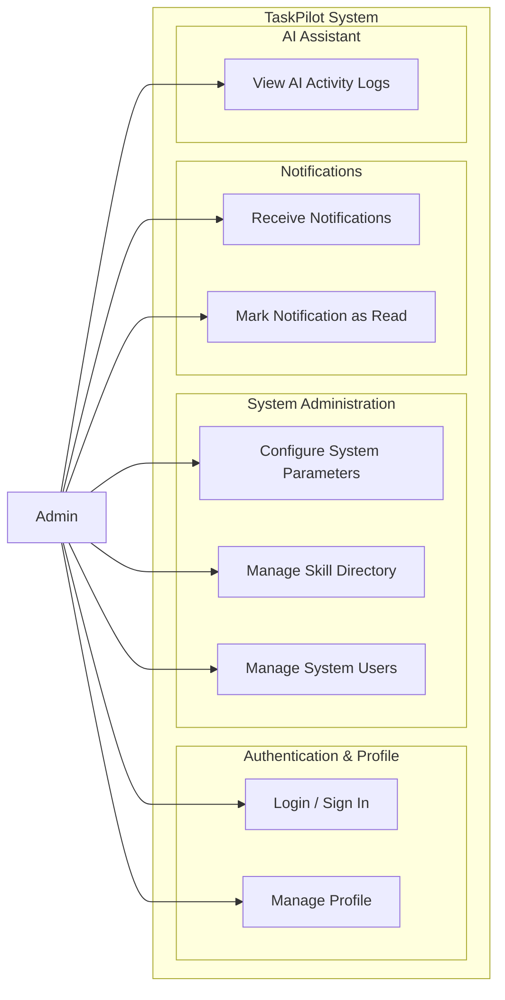

# Use Case by Actor - Admin (Mermaid)

```mermaid
flowchart LR
  AD[Admin]

  subgraph TP[TaskPilot System]
    direction TB

    subgraph AUTH[Authentication & Profile]
      A1[Login / Sign In]
      A2[Manage Profile]
    end

    subgraph SA[System Administration]
      S1[Configure System Parameters]
      S2[Manage Skill Directory]
      S3[Manage System Users]
    end

    subgraph NOTI[Notifications]
      N1[Receive Notifications]
      N2[Mark Notification as Read]
    end

    subgraph AI[AI Assistant]
      I1[View AI Activity Logs]
    end
  end

  AD --> A1
  AD --> A2
  AD --> S1
  AD --> S2
  AD --> S3
  AD --> N1
  AD --> N2
  AD --> I1
```

