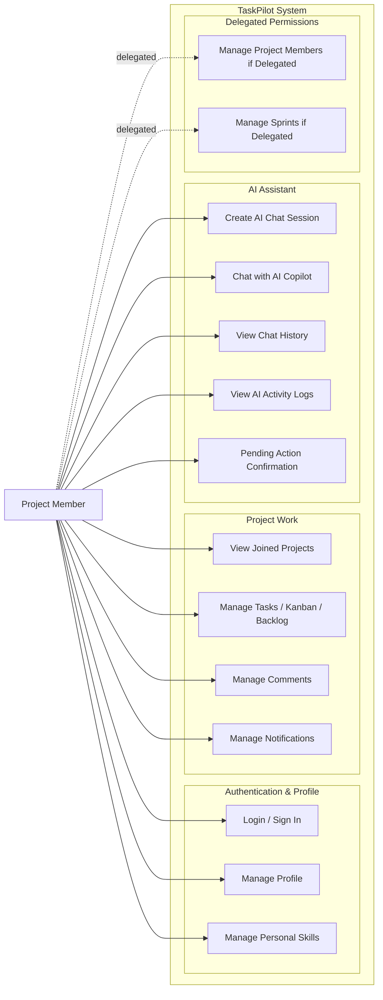

# Use Case by Actor - Project Member (Mermaid)

```mermaid
flowchart LR
  MB[Project Member]

  subgraph TP[TaskPilot System]
    direction TB

    subgraph AUTH[Authentication & Profile]
      A1[Login / Sign In]
      A2[Manage Profile]
      A3[Manage Personal Skills]
    end

    subgraph WORK[Project Work]
      W1[View Joined Projects]
      W2[Manage Tasks / Kanban / Backlog]
      W3[Manage Comments]
      W4[Manage Notifications]
    end

    subgraph AI[AI Assistant]
      I1[Create AI Chat Session]
      I2[Chat with AI Copilot]
      I3[View Chat History]
      I4[View AI Activity Logs]
      I5[Pending Action Confirmation]
    end

    subgraph NOTE[Delegated Permissions]
      D1[Manage Project Members if Delegated]
      D2[Manage Sprints if Delegated]
    end
  end

  MB --> A1
  MB --> A2
  MB --> A3
  MB --> W1
  MB --> W2
  MB --> W3
  MB --> W4
  MB --> I1
  MB --> I2
  MB --> I3
  MB --> I4
  MB --> I5
  MB -. delegated .-> D1
  MB -. delegated .-> D2
```

