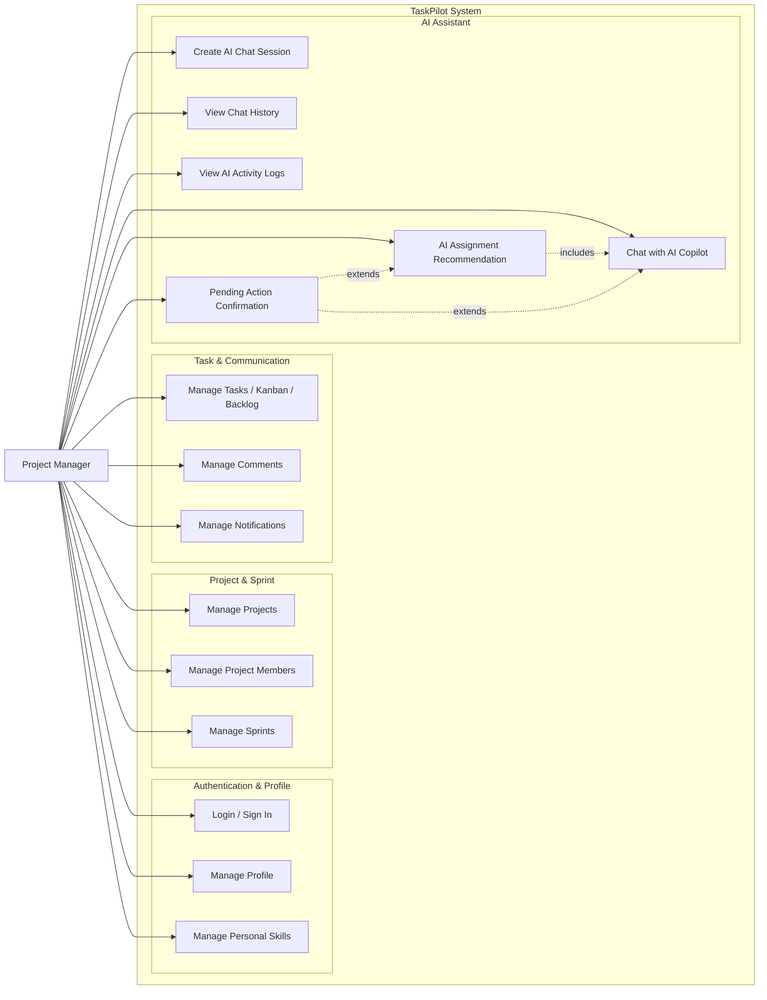

# Use Case by Actor - Project Manager (Mermaid)

```mermaid
flowchart LR
  PM[Project Manager]

  subgraph TP[TaskPilot System]
    direction TB

    subgraph AUTH[Authentication & Profile]
      A1[Login / Sign In]
      A2[Manage Profile]
      A3[Manage Personal Skills]
    end

    subgraph PRJ[Project & Sprint]
      P1[Manage Projects]
      P2[Manage Project Members]
      P3[Manage Sprints]
    end

    subgraph TASK[Task & Communication]
      T1[Manage Tasks / Kanban / Backlog]
      T2[Manage Comments]
      T3[Manage Notifications]
    end

    subgraph AI[AI Assistant]
      I1[Create AI Chat Session]
      I2[Chat with AI Copilot]
      I3[View Chat History]
      I4[View AI Activity Logs]
      I5[AI Assignment Recommendation]
      I6[Pending Action Confirmation]
    end
  end

  PM --> A1
  PM --> A2
  PM --> A3
  PM --> P1
  PM --> P2
  PM --> P3
  PM --> T1
  PM --> T2
  PM --> T3
  PM --> I1
  PM --> I2
  PM --> I3
  PM --> I4
  PM --> I5
  PM --> I6

  I5 -. includes .-> I2
  I6 -. extends .-> I2
  I6 -. extends .-> I5
```

