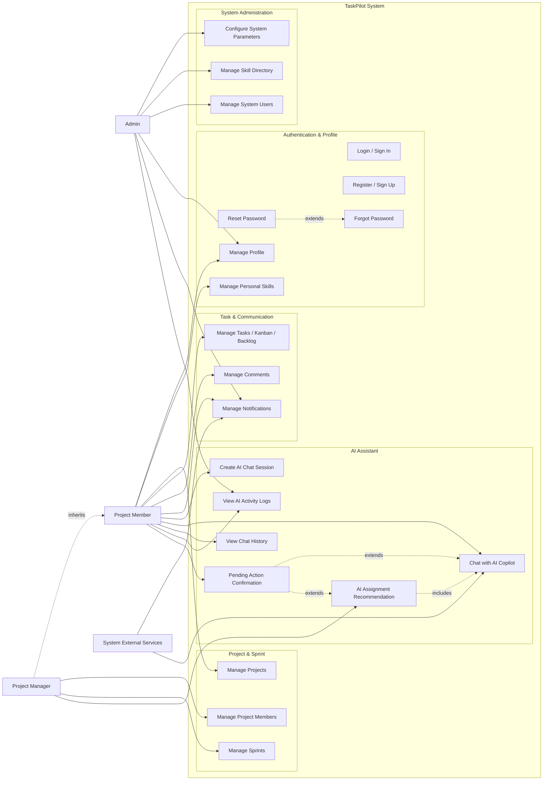

# Use Case Overview - TaskPilot (Mermaid)

```mermaid
flowchart LR
  %% Actors
  AD[Admin]
  PM[Project Manager]
  MB[Project Member]
  SYS[System External Services]

  %% Actor Inheritance to reduce clutter
  PM -. inherits .-> MB

  subgraph TP[TaskPilot System]
    direction TB

    subgraph SA[System Administration]
      S1[Configure System Parameters]
      S2[Manage Skill Directory]
      S3[Manage System Users]
    end

    subgraph AUTH[Authentication & Profile]
      A1[Login / Sign In]
      A2[Register / Sign Up]
      A3[Forgot Password]
      A4[Reset Password]
      P1[Manage Profile]
      P2[Manage Personal Skills]
    end

    subgraph TASK[Task & Communication]
      T1[Manage Tasks / Kanban / Backlog]
      T2[Manage Comments]
      T3[Manage Notifications]
    end

    subgraph PJ[Project & Sprint]
      J1[Manage Projects]
      J2[Manage Project Members]
      J3[Manage Sprints]
    end

    subgraph AI[AI Assistant]
      I1[Create AI Chat Session]
      I2[Chat with AI Copilot]
      I3[View Chat History]
      I4[View AI Activity Logs]
      I5[AI Assignment Recommendation]
      I6[Pending Action Confirmation]
    end
  end

  %% Admin Links
  AD --> S1
  AD --> S2
  AD --> S3
  AD --> P1
  AD --> T3
  AD --> I4

  %% Project Manager (Specifics only, inherits MB)
  PM --> J2
  PM --> J3
  PM --> I5

  %% Project Member Links
  MB --> P1
  MB --> P2
  MB --> J1
  MB --> T1
  MB --> T2
  MB --> T3
  MB --> I1
  MB --> I2
  MB --> I3
  MB --> I4
  MB --> I6

  %% System External Services
  SYS --> T3
  SYS --> I2

  %% Use Case Relationships
  A4 -. extends .-> A3
  I5 -. includes .-> I2
  I6 -. extends .-> I2
  I6 -. extends .-> I5
```
